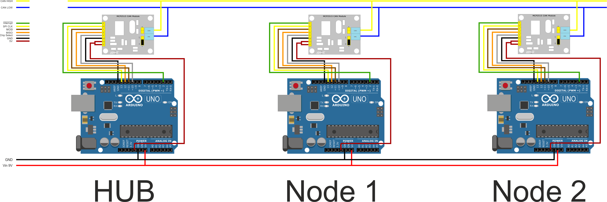
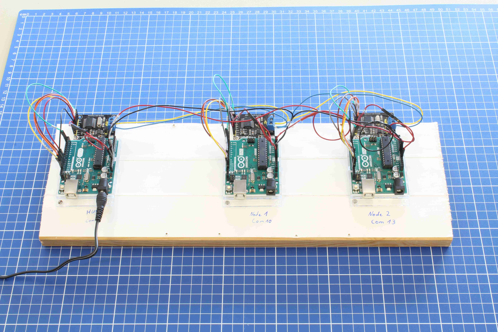

# SmartHome-CanNetworkDemo
Dieses Repository beinhaltet alle Dateien die Nötig sind, um das CAN NetzwerkDemo-Board aufzubauen.
## Aufbau
### Schema

### Foto

### Pinbelegung für alle drei Arduinos gleich
CAN-BUS Modul | Arduino | ATMEGA328P
--------------|---------|-----------
INT (Invertiert)|2|PD2
SCK SPI CLK|13|PB5
SI MOSI|11|PB3
SO MISO|12|PB4
CS Chip Select|10|PB2
GND|GND|GND
VCC1 Versorgung|5V|\-
VCC Spg. Logikpegel|5V|\-

### Zuordnung ATMEGA328P Pins <-> Arduino
ATMEGA328P | Arduino
-----------|--------
PB0|8
PB1|9
PB2|10
PB3|11
PB4|12
PB5|13
PC0|A0
PC1|A1
PC2|A2
PC3|A3
PC4|A4
PC5|A5
PD0|0
PD1|1
PD2|2
PD3|3
PD4|4
PD5|5
PD6|6
PD7|7

